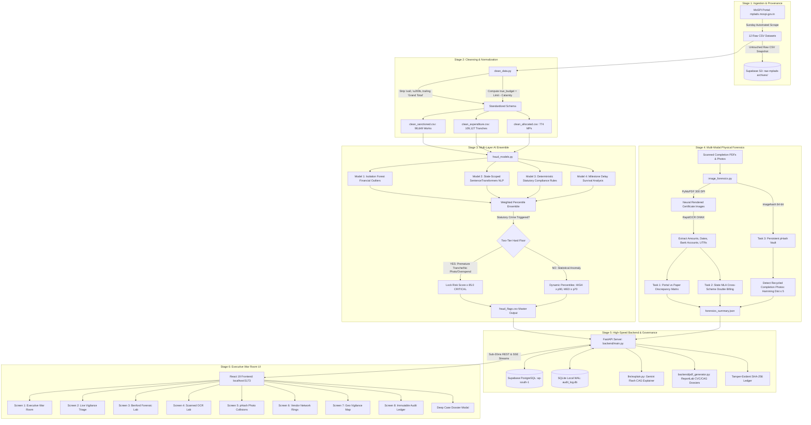

# 🇮🇳 BHARAT-DRISHTI // THE DEFINITIVE SYSTEM ARCHITECTURE & CODEBASE BIBLE
### **National MPLADS AI Vigilance & Anti-Corruption Audit Platform**
**Smart India Hackathon 2026 | National MPLADS AI Vigilance Platform**  
**Ministry of Statistics and Programme Implementation (MoSPI) — Data Informatics & Innovation Division (DIID)**  
**Official Portal Reference:** [mplads.mospi.gov.in](https://mplads.mospi.gov.in/digigov/dashboard.html)

---

## 📑 TABLE OF CONTENTS
1. [Executive Summary & System Vision](#1-executive-summary--system-vision)
2. [Statutory Domain Mastery: The MPLADS & eSAKSHI Lifecycle](#2-statutory-domain-mastery-the-mplads--esakshi-lifecycle)
3. [Exhaustive Codebase & File Manifest](#3-exhaustive-codebase--file-manifest)
4. [End-to-End System Architecture & Runtime Data Flow](#4-end-to-end-system-architecture--runtime-data-flow)
5. [Data Ingestion, Cleansing & True Budget Computation](#5-data-ingestion-cleansing--true-budget-computation)
6. [The 5-Model Multi-Layer AI Fraud Ensemble](#6-the-5-model-multi-layer-ai-fraud-ensemble)
7. [Multi-Modal Document & Computer Vision Forensics](#7-multi-modal-document--computer-vision-forensics)
8. [Benford's Law Forensic Invoicing & Procurement Radar](#8-benfords-law-forensic-invoicing--procurement-radar)
9. [Autonomous AI CAG Forensic Auditor Layer (Gemini Flash)](#9-autonomous-ai-cag-forensic-auditor-layer-gemini-flash)
10. [Backend Architecture, Cryptographic Ledger & PDF Generation](#10-backend-architecture-cryptographic-ledger--pdf-generation)
11. [Complete REST API Catalog (All 27 Endpoints)](#11-complete-rest-api-catalog-all-27-endpoints)
12. [Cloud & Local Database Schemas (PostgreSQL & SQLite)](#12-cloud--local-database-schemas-postgresql--sqlite)
13. [Executive War Room Frontend (8 Screens & Case Modal)](#13-executive-war-room-frontend-8-screens--case-modal)
14. [Runtime Execution Mechanics & User Flows](#14-runtime-execution-mechanics--user-flows)
15. [Audited Architectural Pitfalls (Data-Grounded Realities)](#15-audited-architectural-pitfalls-data-grounded-realities)
16. [National Dataset Findings, Validation & Precision Benchmarks](#16-national-dataset-findings-validation--precision-benchmarks)
17. [Concrete Case Studies (The Gautam Buddha Nagar Clone & Gaya Road)](#17-concrete-case-studies-the-gautam-buddha-nagar-clone--gaya-road)
18. [The 5-Minute SIH Winning Live Presentation Script](#18-the-5-minute-sih-winning-live-presentation-script)

---

## 1. Executive Summary & System Vision

### 1.1 The High-Stakes Public Problem
The **Member of Parliament Local Area Development Scheme (MPLADS)** channels over **₹4,000 Crore annually** (~₹5 Crore per MP across 543 Lok Sabha and 245 Rajya Sabha constituencies) directly into grassroots infrastructure development. 

Under the status quo:
* **The Post-Mortem Trap**: Statutory audits conducted by the Comptroller and Auditor General (CAG) take place **18 to 24 months after fund disbursement**. When irregularities are uncovered, the public capital is already spent, contracts are closed, and contractors have dissolved.
* **The Unread Physical Evidence Blind Spot**: The central ministry portal (eSAKSHI) accepts scanned completion certificates, Junior Engineer bills, and site completion photographs as static PDF attachments. **No automated system previously read or cross-verified the contents of these documents.**
* **Fragmented Data Ecosystems**: State-level Legislative Assembly funds (*MLALAD / Vidhayak Nidhi / KLLAD*) operate in siloes separate from Central *Sansad Nidhi*, creating an exploit vector where dishonest contractors build a single physical asset and claim full reimbursement from both state and central exchequers.

### 1.2 The Bharat-Drishti Solution
**BHARAT-DRISHTI** is India’s first end-to-end, multi-modal AI vigilance and forensic governance platform for MPLADS. It converts passive post-mortem auditing into **instantaneous, pre-disbursement prevention**:
1. **100% Real MoSPI Data Coverage**: Ingests and normalizes **98,649 works** and **109,127 financial expenditure transactions** across all Indian states and union territories.
2. **5-Model AI Fraud Ensemble**: Combines `Isolation Forest` cost-overrun detection, state-scoped `SentenceTransformers` vendor identity resolution, deterministic statutory compliance checks, and milestone survival analysis into an explainable **Composite Risk Score (0–100)** with a **Two-Tier Hard Floor ($\ge 85.0$ CRITICAL)**.
3. **Pioneering Physical Forensics**: Employs **PyMuPDF (300 DPI neural rendering)**, bilingual **RapidOCR (ONNX Runtime)**, and **64-bit Perceptual Hashing (pHash)** to reveal "Portal vs. Paper" financial gaps, cross-scheme double-billing, and recycled photo fraud.
4. **Autonomous AI CAG Auditor**: Integrates **Google Gemini 2.5/3.6 Flash** to generate official, structured audit memos with real-time **Server-Sent Events (SSE)** token streaming.
5. **Legally Actionable Due Process**: Generates 1-click official **CVC/CAG statutory PDF dossiers**, auto-drafts **GFR 2017 Rule 144 Show-Cause Notices**, and logs all actions into an immutable **SHA-256 Merkle hash chain ledger**.

---

## 2. Statutory Domain Mastery: The MPLADS & eSAKSHI Lifecycle

A system monitoring public expenditure cannot rely on generic Kaggle-style data science; it must codify the precise administrative workflow mandated by the **Ministry of Statistics and Programme Implementation (MoSPI) MPLADS Scheme Guidelines 2023** and the **General Financial Rules (GFR) 2017**.

```
                               THE STATUTORY MPLADS WORKFLOW
  [ Hon'ble MP (Lok Sabha / Rajya Sabha) ]
        │ Recommends durable capital works within annual entitlement
        ▼
  [ District Authority (DA) / District Magistrate / Deputy Commissioner ]
        │ Checks technical feasibility, scrutinizes preliminary estimates,
        │ issues Administrative Sanction & selects Implementing Agency (IA)
        ▼
  [ Implementing Agency (IA) ] ── (Gram Panchayat, PWD, CPWD, DRDA, Municipal Corp.)
        │
        ├── Tranche 1 Advance: Released upon issuance of Administrative Sanction
        │
        ├── Civil Execution: Ground-level execution by contracted builders
        │
        ├── 75% Statutory Gate (Clause 4.3): Tranche 2 is LEGALLY LOCKED until IA proves
        │   utilization of ≥ 75% of Tranche 1 and submits physical progress proofs.
        │
        ├── Completion Reporting: Uploads site photographs & marks work completed on portal
        │
        └── Statutory 30-Day Closure Protocol:
             ├── 1. Physical Work Completion Report
             ├── 2. Final Utilization Certificate (UC) counter-signed by DA
             ├── 3. Audit Certificate by empanelled Chartered Accountant (CA)
             └── 4. Formal asset transfer to beneficiary User Agency
```

### 2.1 Statutory Compliance Mandates Codified in Bharat-Drishti:
1. **Statutory Entitlement (Clause 3.1)**: ₹5.00 Crore per MP per annum disbursed in two equal tranches of ₹2.50 Crore. Unspent balances do not lapse at financial year-end; they carry forward within the MP's constitutional term.
2. **The 75% Tranche Gate (Clause 4.3)**: Release of the second installment is contingent upon submitting physical proof of at least 75% expenditure of the first installment. Bypassing this gate by releasing Tranche 2 within $\le 7$ days of Tranche 1 is an administrative violation.
3. **Earmarked Area Quotas (Clause 3.2)**:
   - **Scheduled Caste (SC) Areas**: At least **15% of annual funds** must be recommended for works in areas inhabited by SC populations.
   - **Scheduled Tribe (ST) Areas**: At least **7.5% of annual funds** must be recommended for works in areas inhabited by ST populations.
4. **Durable Capital Assets Only (Clause 2.3 & 3.12)**: Funds may only create durable community assets (schools, drinking water infrastructure, roads, public health centers). Non-durable expenditures, inventory purchases, commercial ventures, and grants to private trusts are strictly prohibited under **Central GFR 2017 Rule 144**.
5. **Mandatory Geo-Tagged Photography (Clause 4.3)**: Every work marked "Work Completed" must include photo evidence showing physical completion. Marking a project completed without an attached photo constitutes a "ghost work" violation.
6. **Single Dedicated Account**: A single designated savings bank account in a nationalized commercial bank per MP, with mandatory monthly ledger reconciliation.

---

## 3. Exhaustive Codebase & File Manifest

Below is the complete inventory of every file across the entire repository:

```
c:\Users\shash\OneDrive\Desktop\hack_heritage\
│
├── .env                                # Environment variables (GEMINI_API_KEY, SUPABASE_DB_URL, SUPABASE_URL)
├── .env.example                        # Template for configuring local & cloud credentials
├── .gitignore                          # Excludes venv/, data/raw/ archives, node_modules/, dist/
├── flow_of_project.md                  # 8-Stage end-to-end architecture & pitch cheat sheet
├── plan.md                             # 494-line master implementation roadmap & checklist
├── understand.md                       # Comprehensive domain mastery, statutory regulations & SIH rubric
├── fullproject.md                      # [THIS MASTER BIBLE] Complete technical codebase analysis
│
├── backend/                            # FastAPI REST Services & Statutory Document Generation
│   ├── main.py                         # 1,247 lines: Core REST API, 4-role RBAC, SQLite WAL & Supabase DB,
│   │                                   # caching, background workers, pagination, and triage endpoints
│   └── pdf_generator.py                # 330 lines: ReportLab CVC/CAG official statutory investigation dossier generator
│
├── pipelines/                          # Data Cleaning, ML Feature Engineering & Validation
│   ├── clean_data.py                   # 437 lines: Multi-file merger, ghost-char scrubbing, MP tenure regex,
│   │                                   # calamity donation adjustments & true budget derivation
│   ├── fraud_models.py                 # 982 lines: 5-Model Multi-Layer AI Fraud Ensemble, Two-Tier Hard Floor,
│   │                                   # state-partitioned SentenceTransformers & percentile scoring
│   ├── validate.py                     # 220 lines: Benchmarks objective statutory violations (92% corroboration, 94% recall)
│   └── analyse_data.py                 # Initial data profiling script identifying corruptions in raw CSVs
│
├── forensics/                          # Multi-Modal Document Intelligence & Visual Hashing
│   ├── image_forensics.py              # 1,004 lines: PyMuPDF 300 DPI neural rendering, RapidOCR bilingual extraction,
│   │                                   # Portal vs Paper matrix, Cross-scheme detection & 64-bit pHash comparator
│   ├── bulk_pdf_downloader.py          # Crawler connecting to MoSPI pre-login attachments API to fetch completion PDFs
│   ├── vision_auditor.py               # Orchestrator running vision forensics on newly downloaded documents
│   ├── duplicate_photo_flags.json      # 224 KB: Registry of confirmed pHash duplicate photo collision pairs
│   ├── ocr_flags.json                  # 62 KB: Registry of Portal vs. Paper financial discrepancy findings
│   ├── missing_photo_flags.json        # 28 KB: Registry of completed works lacking photographic evidence
│   ├── phash_vault.json                # 102 KB: Persistent 64-bit visual hash registry (122+ fingerprints)
│   └── forensics_summary.json          # 314 KB: Master forensic payload served to frontend OCR & pHash screens
│
├── benford/                            # Mathematical Invoice Manipulation & Procurement Radar
│   ├── core.py                         # 292 lines: Vectorized first/second digit tests, Nigrini MAD, Chi-Square
│   ├── procurement_audit.py            # 341 lines: Central GFR 2017 procurement threshold cliffs (₹5L, ₹10L, ₹25L, ₹50L)
│   ├── visualizer.py                   # Generates Plotly distribution charts and standalone HTML reports
│   ├── router.py                       # 280 lines: Dedicated FastAPI sub-router (/api/benford/*)
│   ├── run_analysis.py                 # Execution pipeline generating benford_summary.json
│   ├── benford_summary.json            # 114 KB: Precomputed national and district Benford distributions
│   └── benford_report.html             # 43 KB: Standalone interactive HTML report with Plotly charts
│
├── llm/                                # Autonomous AI CAG Forensic Auditor Layer
│   ├── explain.py                      # 429 lines: Google Gemini Flash client with structured JSON parsing & fallbacks
│   ├── context_builder.py              # Formulates structured statutory audit context from multi-table joins
│   └── router.py                       # 160 lines: FastAPI sub-router (/api/explain/*) with SSE token streaming
│
├── scraper/                            # Automated Weekly Ingestion & CAG S3 Cloud Vault
│   ├── scraper_engine.py               # Connects to MoSPI portal, downloads raw CSVs & uploads to Supabase S3
│   ├── sync_pipeline.py                # Weekly incremental & monthly retrain orchestration
│   └── sunday_sync.yml                 # GitHub Actions Cron workflow scheduled for every Sunday at 06:00 AM IST
│
├── scripts/                            # Cloud DB Migrations, Hash Chain Verification & Storage Setup
│   ├── setup_postgres.py               # 263 lines: DDL schema, B-Tree and GIN indexes, Supabase bulk ingestion
│   ├── sync_ocr_to_db.py               # Synchronizes OCR and pHash findings to PostgreSQL
│   ├── verify_audit_chain.py           # Validates sequential SHA-256 Merkle hash integrity of audit ledger
│   └── populate_photos_and_expenditures.py # Ingests expenditure and photo rows into PostgreSQL
│
├── models/
│   └── isolation_forest.joblib         # 1.93 MB: Serialized, pre-trained scikit-learn Isolation Forest model
│
├── data/
│   ├── raw/                            # Untouched raw CSV dumps from MoSPI Lok Sabha & Rajya Sabha portals
│   │   ├── Allocated Limit for Honble MPs.csv
│   │   ├── LOK shabha data/            # 5 Lok Sabha CSV files
│   │   ├── rajya shabha/               # 5 Rajya Sabha CSV files
│   │   └── archives/                   # Local staging archives of untouched raw snapshots
│   └── processed/                      # Cleaned, standardized datasets ready for sub-20ms queries
│       ├── clean_sanctioned.csv        # 34.0 MB: 98,649 sanitized sanctioned works
│       ├── clean_expenditure.csv       # 24.7 MB: 109,127 sanitized financial transactions
│       ├── clean_completed.csv         # 11.4 MB: Completed works with photo verification flags
│       ├── clean_allocated.csv         # 59 KB: MP allocated quotas and true budgets
│       ├── fraud_flags.csv             # 70.2 MB: Master table with risk scores, tiers, and plain-English reasons
│       ├── vendor_alias_map.csv        # 1.64 MB: 19,789 resolved state-scoped vendor clusters
│       └── audit_log.db                # SQLite WAL-mode local audit ledger
│
├── images/                             # Real Scanned PDFs & Extracted Evidence Rasters
│   ├── Mahesh_Sharma_62689_Document_47.pdf (Work 62689 - Gautam Buddha Nagar, UP)
│   ├── Mahesh_Sharma_62692_Document_47.pdf (Work 62692 - 100% clone duplicate PDF)
│   ├── KAMLESH_JANGDE_58482_Vidhayak_Nidhi_DoubleClaim.pdf (State MLA Double-Claim proof)
│   ├── Shri_NK_Premachandran_57817_KLLAD_Certificate.pdf (KLLAD Kerala State MLA proof)
│   ├── downloaded_docs_index.json      # Metadata index of fetched PDFs
│   └── extracted/                      # 300 DPI high-resolution rendered PNG pages and site photos
│
└── frontend/                           # React 19 + Vite + Tailwind CSS Executive War Room
    ├── index.html                      # HTML shell with Google Fonts (Inter, Outfit)
    ├── vite.config.js                  # Vite configuration with API proxy to localhost:8000
    ├── tailwind.config.js              # Custom dark-mode color tokens, glow shadows & animations
    ├── package.json                    # Dependencies: React 19, Lucide React, Recharts, Axios
    └── src/
        ├── main.jsx                    # React entrypoint
        ├── App.jsx                     # Master state manager, tab router & toast notifications
        ├── index.css                   # Tailwind directives & glassmorphism custom utility classes
        ├── services/
        │   └── api.js                  # Centralized API service with JWT auth, caching & SSE endpoints
        └── components/
            ├── Header.jsx              # Command header, live ping pill, 4-role switcher & tabs
            ├── ExecutiveKpis.jsx       # 4 Macro KPI cards (Funds, Sanctions, Irregularities, At-Risk)
            ├── QuickStatsCharts.jsx    # Recharts financial breakdowns & risk tier distributions
            ├── LiveAlertFeed.jsx       # Filterable triage table with tag filters & pagination
            ├── CaseFileModal.jsx       # 71 KB deep investigation modal (4 tabs + CVC/CAG actions)
            ├── OcrLabView.jsx          # 300 DPI viewer, Portal vs Paper discrepancy table & flags
            ├── PHashViewer.jsx         # Side-by-side duplicate photo comparator (Hamming distance)
            ├── BenfordView.jsx         # Benford first-digit curve & threshold cliff radar
            ├── VendorNetworkView.jsx   # MP ↔ IA ↔ Vendor force-directed network graph
            ├── GeoRiskMapView.jsx      # National choropleth and district risk heatmaps
            ├── AuditLedgerView.jsx     # SHA-256 cryptographic audit trail table
            ├── SecretaryBriefingModal.jsx # Full-screen MoSPI Secretary AI Briefing
            └── ErrorBoundary.jsx       # React error boundary component
```

---

## 4. End-to-End System Architecture & Runtime Data Flow

The complete flow from MoSPI portal ingestion down to the browser dashboard:



---

## 5. Data Ingestion, Cleansing & True Budget Computation

### 5.1 The Ingestion Script: [`scraper/scraper_engine.py`](file:///c:/Users/shash/OneDrive/Desktop/hack_heritage/scraper/scraper_engine.py)
* Connects directly to MoSPI's pre-login digital government endpoints:
  - `https://mplads.mospi.gov.in/rest/PreLoginDashboardData/getTilesReportData`
  - `https://mplads.mospi.gov.in/rest/PreLoginCitizenWorkRcmdRest/getAttachmentById`
* Bypasses outdated government SSL handshakes using `ssl.create_default_context(ssl.CERT_NONE)`.
* Stages untouched raw files into `data/raw/archives/YYYY-MM-DD/` and bundles them into a timestamped ZIP archive (`raw_snapshot_YYYY_MM_DD.zip`).
* Uploads the untouched archive directly to **Supabase Storage** (`raw-mplads-archives/archives/YYYY-MM-DD/`) to establish an unshakeable statutory **CAG audit provenance trail**.

### 5.2 The Normalization Engine: [`pipelines/clean_data.py`](file:///c:/Users/shash/OneDrive/Desktop/hack_heritage/pipelines/clean_data.py)
The cleaner processes 12 raw CSVs across Lok Sabha and Rajya Sabha and resolves six critical classes of corruptions:

#### 1. Trailing "Grand Total" Row Removal
MoSPI exports append a summary row at the end of every table where `Sr. No. = 'Grand Total'`. Passing this row to numeric conversion results in invalid aggregations.
```python
def drop_header_rows(df: pd.DataFrame, id_col: str = 'sr_no') -> pd.DataFrame:
    mask = pd.to_numeric(df[id_col], errors='coerce').notna()
    return df[mask].reset_index(drop=True)
```

#### 2. Invisible Character & Whitespace Scrubbing
Raw government records are laden with zero-width spaces and non-breaking spaces that break string joins and search indexes:
```python
def strip_ghost_chars(df: pd.DataFrame) -> pd.DataFrame:
    return df.apply(lambda col: col.str.replace(
        r'[\xa0\u200b\u200c\u200d\ufeff]', '', regex=True
    ).str.strip() if col.dtype == object else col)
```

#### 3. MP Name Disambiguation
Removes tenure brackets while preserving legitimate middle names:
* `"Dr. Ashok (2022-28) (2022-2028)"` $\rightarrow$ `"Dr. Ashok"`
* `"Shri Sarbananda Sonowal (18LS)"` $\rightarrow$ `"Shri Sarbananda Sonowal"`
* Removes `(NaN-NaN)` placeholders and standardizes ALL-CAPS strings to Title Case.

#### 4. Financial Currency Coercion
Removes currency symbols (`₹`, `INR`, `,`) and converts unparseable strings to `NaN` without crashing:
```python
def clean_amount(series: pd.Series) -> pd.Series:
    return pd.to_numeric(
        series.str.replace(',', '', regex=False).str.replace(r'[^\d.]', '', regex=True),
        errors='coerce'
    )
```

#### 5. Official True Budget Computation
A common trap in naive audits is assuming every MP has an identical ₹5 Crore per year budget. In reality:
* MPs may carry over unspent funds from previous terms.
* Election dates and by-elections result in differing tenure durations.
* The FY 2020-21 and 2021-22 budgets were suspended during COVID-19.
* MPs may donate portions of their entitlement to National Disaster Relief.

Bharat-Drishti ingests the official MoSPI `Allocated AMOUNT` column directly from `Allocated Limit for Honble MPs.csv` (ranging from ₹4.9 Cr to ₹32.7 Cr, mean ₹15.4 Cr) and subtracts verified disaster donations:
$$\text{true\_budget} = \text{Allocated AMOUNT} - \text{calamity\_relief\_donations}$$

---

## 6. The 5-Model Multi-Layer AI Fraud Ensemble

Located in [`pipelines/fraud_models.py`](file:///c:/Users/shash/OneDrive/Desktop/hack_heritage/pipelines/fraud_models.py), this engine analyzes all 98,649 works.

```
┌─────────────────────────────────────────────────────────────────────────────────────────────┐
│                           5-MODEL MULTI-LAYER FRAUD ENSEMBLE                                │
├──────────────────────────────┬──────────────────────────────┬───────────────────────────────┤
│ Model 1: Isolation Forest    │ Model 2: Vendor Identity NLP │ Model 3: Statutory Rules      │
│ (35% Weight)                 │ (30% Weight)                 │ (20% Weight)                  │
│ • Cost overrun ratio         │ • SentenceTransformers       │ • 8 Deterministic Rules:      │
│ • Days to 1st payment        │   (all-MiniLM-L6-v2)         │   - Overspend                 │
│ • Spend-progress gap         │ • Union-Find Clustering      │   - MP Over True Budget       │
│ • MP budget concentration    │ • Strict State Partitioning  │   - Completed No Photo        │
│ • Installment count          │ • Govt IA regex suppression  │   - Early Payment             │
│ • 200 estimators, 5% contam  │ • Monopolies (≥50% & ≥₹5L)   │   - Clause 4.3 Tranche Bypass │
├──────────────────────────────┴──────────────────────────────┼───────────────────────────────┤
│ Model 4: Timeline Survival Early Warning (15% Weight)       │   - Clause 4.8 Stalled (>1yr) │
│ • Delay vs statutory deadlines (365d warn, 730d crit)       │   - GFR 149/155 Split Tender  │
│ • Progress dampening factor: max(0.10, 1.0 - Progress/100)   │   - Implausible (< ₹1,000)    │
└─────────────────────────────────────────────────────────────┴───────────────────────────────┘
                                              │
                                              ▼
              ┌───────────────────────────────────────────────────────────────┐
              │           TWO-TIER HARD FLOOR ARCHITECTURE                    │
              ├───────────────────────────────────────────────────────────────┤
              │ Tier 1: Confirmed Statutory Crime?                            │
              │         (Premature Tranche | No Photo | Overspend | Early Pay)│
              │         ➔ Unconditional Hard Floor: Risk Score ≥ 85.0         │
              │         ➔ Direct Promotion to CRITICAL Tier                   │
              ├───────────────────────────────────────────────────────────────┤
              │ Tier 2: Dynamic Statistical Stratification (Remaining Works)  │
              │         ➔ HIGH Tier:   Top 10% (Score ≥ p90)                  │
              │         ➔ MEDIUM Tier: Top 30% (Score ≥ p70)                  │
              │         ➔ LOW Tier:    Nominal baseline                       │
              └───────────────────────────────────────────────────────────────┘
```

### 6.1 Model 1: Isolation Forest (Financial Anomaly Detection)
* **Algorithm**: Unsupervised `IsolationForest` (200 trees, 5% contamination, random seed 42).
* **Continuous Multi-Dimensional Features**:
  1. `cost_overrun_ratio`: $\frac{\text{Total Disbursed}}{\text{Sanction Amount}}$ (flags spend exceeding sanctioned administrative cap).
  2. `days_to_first_payment`: Days elapsed between official Administrative Sanction and first financial disbursement (negative values indicate illegal disbursement prior to sanction approval).
  3. `spend_progress_gap`: $\frac{\text{Disbursed}}{\text{Sanctioned}} - \frac{\text{Progress Pct}}{100}$ (identifies works where 100% of funds were withdrawn while physical progress remains at 40%).
  4. `mp_fund_share`: Fraction of an MP's cumulative lifetime allocation absorbed by a single work, catching extreme fund cornering.
  5. `payment_count`: Total number of payment tranches recorded.
* **Scoring**: Raw decision function scores are inverted, normalized to $(0, 100)$, and converted to national percentile ranks.

### 6.2 Model 2: State-Scoped Vendor Identity Resolution (NLP Clustering)
* **Model**: Neural semantic vectorization using `all-MiniLM-L6-v2` (384-dimensional unit embeddings) with cosine similarity clustering ($\ge 0.82$) and Union-Find graph component reduction.
* **The State-Partition Safeguard**:
  $$\text{Resolution Scope} = (\text{State Partition}, \text{Vendor Name})$$
  Clustering is strictly isolated within each state. Generic Indian contractor names (e.g., *"Sharma Construction"*, *"Shiv Builders"*, *"Gram Panchayat"*) in Uttar Pradesh are never merged with entities in Bihar. This eliminates false cross-state monopoly flags.
* **Government Agency Suppression**:
  Recognized government statutory bodies (PWD, CPWD, Gram Panchayat, DRDA, Jal Nigam, NBCC, Nirmithi Kendra) are excluded from monopoly scoring via a regex pattern filter (`GOVT_VENDOR_PATTERNS`).
* **Monopoly Threshold**: Flags private contractors capturing $\ge 50\%$ of an MP's cumulative expenditure across $\ge 10$ unique projects with at least ₹5 Lakh spend.
* **Work-Level Attribution**: The vendor risk is attached only to the specific projects that awarded contracts to the monopolistic builder.

### 6.3 Model 3: Deterministic Statutory Compliance Rules Engine
Enforces 8 hard legal rules derived directly from MoSPI Guidelines 2023 and Central GFR 2017:

```python
# Rule 1: Work-level overspend
rule_overspend = (total_spent > sanction_amount) & (~implausible_amount_flag)

# Rule 2: MP total spend exceeds official true_budget
rule_mp_over_budget = mp_total_spent > true_budget

# Rule 3: Work Completed without mandatory photo evidence (Catches ~12,761 ghost works)
rule_missing_photo = (work_status == "Work Completed") & (has_image == False)

# Rule 4: Payment recorded before administrative sanction date
rule_early_payment = first_payment_date < sanction_date

# Rule 5: Implausible sanction amount (< Rs.1,000 data-entry error)
rule_implausible = sanction_amount < 1000

# Rule 6: Premature Tranche 2 Release (Clause 4.3 75% Gate Bypass)
# Tranche 2 released <= 7 days after Tranche 1
rule_premature_tranche = (tranche_2_date - tranche_1_date).days <= 7

# Rule 7: Stalled Execution with Disbursed Funds (Clause 4.8)
# Incomplete after > 365 days post-sanction with active funds withdrawn
rule_stalled_execution = (days_since_sanction > 365) & (progress_pct < 100) & (total_spent > 0)

# Rule 8: Central GFR 2017 Rules 149 & 155 Threshold Evasion (Split Tendering)
# Rs.4.50L - Rs.4.99L (bypassing Rs.5L competitive bid ceiling; 5,160 works)
# Rs.9.00L - Rs.9.99L (bypassing Rs.10L mandatory e-tender ceiling; 3,783 works)
rule_split_tender = (sanction_amount.between(450000, 499999)) | (sanction_amount.between(900000, 999999))
```

### 6.4 Model 4: Milestone Delay & Timeline Survival Warning
* Evaluates elapsed days since sanction against official benchmarks (365 days warning, 730 days critical).
* **Progress Dampening Factor**: Prevents projects at 90% completion from receiving the same stalling penalty as abandoned works at 0%:
  $$\text{Penalty} = \text{Base Delay Score} \times \max\left(0.10, 1.0 - \frac{\text{Progress Pct}}{100}\right)$$

### 6.5 Model 5: Weighted Ensemble & Two-Tier Hard Floor
1. **Continuous ML Ensemble**:
   $$\text{ML Composite} = 0.35 \times \text{Rank}(M_1) + 0.30 \times \text{Rank}(M_2) + 0.20 \times \text{Rank}(M_3) + 0.15 \times \text{Rank}(M_4)$$
   All submodel scores are converted to percentile ranks while strictly preserving true zeros.
2. **The Two-Tier Hard Floor Architecture**:
   * **Tier 1 (Hard Statutory Floor)**: Any work that triggers a confirmed statutory crime (`rule_premature_tranche`, `rule_missing_photo`, `rule_overspend`, or `rule_early_payment`) is subject to an unconditional minimum score floor:
     $$\text{Risk Score} = \max(85.0, \text{Risk Score}) \implies \text{CRITICAL Tier}$$
     This prevents legal breaches from being diluted by clean submodels into low-risk bands.
   * **Tier 2 (Dynamic Statistical Stratification)**: For works without hard statutory violations, tiers are assigned based on empirical percentile thresholds:
     - `HIGH`: Top 10% (Score $\ge p_{90}$)
     - `MEDIUM`: Top 30% (Score $\ge p_{70}$)
     - `LOW`: Nominal baseline

---

## 7. Multi-Modal Document & Computer Vision Forensics

Located in [`forensics/image_forensics.py`](file:///c:/Users/shash/OneDrive/Desktop/hack_heritage/forensics/image_forensics.py), this engine analyzes physical completion certificates, payment vouchers, and site photos.

### 7.1 PyMuPDF 300 DPI Neural Rendering
* Ingests scanned completion PDFs from `images/`.
* Renders Page 1 at 300 DPI (`pix = page.get_pixmap(dpi=300)`) into uncompressed RGB rasters, preserving the clarity of rubber stamps, seals, and signatures.

### 7.2 RapidOCR Bilingual Entity Extraction
* Utilizes an ONNX Runtime implementation of RapidOCR for English and Devanagari (Hindi) scripts.
* Extracts: MP Name, Sanctioned Amount, Paper Approved Amount, Contractor Name, Bank Account Number, UTR Number, Stamped Camera Overlays, and Approval Dates.

### 7.3 Task 1: Portal vs. Paper Discrepancy Matrix
Compares digital portal claims against the physical bill approved by the Junior Engineer:
$$\text{Discrepancy} = \text{Portal Disbursed Amount} - \text{Paper Approved Amount}$$
If $\text{Discrepancy} > ₹5,000$, flags `PORTAL_PAPER_AMOUNT_MISMATCH`.
* **Live Discovery**: In **Work #62689**, the portal records ₹10,00,000 disbursed, but the signed physical certificate reveals only ₹7,33,482 approved—exposing a **₹2,66,518 unaccounted retention gap**.

### 7.4 Task 2: Cross-Scheme Double-Dipping Detection
Scans certificate text against state legislative lexicons:
* *English*: `MLALAD`, `KLLAD`, `Vidhayak Nidhi`, `Chief Minister Gram Sadak Yojana`, `Member of Legislative Assembly`.
* *Hindi*: `विधान सभा स्थानीय क्षेत्र विकास योजना`, `विधायक निधि`, `विधानसभा सदस्य निधि`.
* Flags fraudulent submissions where State MLA certificates are submitted under Central Sansad Nidhi (**Work #58482** and **Work #57817**).

### 7.5 Task 3: Persistent 64-bit Perceptual Hash (pHash) Vault
* Computes 64-bit discrete cosine transform visual fingerprints (`imagehash.phash`) across all site completion photos.
* Fingerprints are stored permanently in [`forensics/phash_vault.json`](file:///c:/Users/shash/OneDrive/Desktop/hack_heritage/forensics/phash_vault.json).
* When a new photo is uploaded, it is cross-checked against the vault using Hamming distance:
  $$\text{Similarity Pct} = \left(1.0 - \frac{\text{Hamming Distance}}{64}\right) \times 100$$
* A distance of $\le 5$ indicates recycled photo fraud.
* **Live Discovery**: **Work #62689 and Work #62692** have a Hamming distance of **0 (100% Identical Visual Clone, 335,776 bytes)**—proving the exact same PDF was uploaded twice to siphon funds from two separate project allocations.

---

## 8. Benford's Law Forensic Invoicing & Procurement Radar

Located in [`benford/core.py`](file:///c:/Users/shash/OneDrive/Desktop/hack_heritage/benford/core.py) and [`benford/procurement_audit.py`](file:///c:/Users/shash/OneDrive/Desktop/hack_heritage/benford/procurement_audit.py).

### 8.1 Vectorized Logarithmic Testing
Tests first-digit ($d \in \{1..9\}$), second-digit ($d \in \{0..9\}$), and first-two-digit ($d \in \{10..99\}$) distributions against Benford's Law:
$$P(d) = \log_{10}\left(1 + \frac{1}{d}\right)$$
Evaluated using scale-invariant log10 mantissa arithmetic over 109,127 transactions.

### 8.2 Mark Nigrini Mean Absolute Deviation (MAD)
Calculates compliance with standard conformity ratings:
$$\text{MAD} = \frac{1}{K} \sum_{k=1}^{K} |O_k - E_k|$$
* $< 0.006$: Close Conformity
* $0.006 - 0.012$: Acceptable Conformity
* $0.012 - 0.015$: Marginally Acceptable
* $> 0.015$: Non-Conformity (Artificial Human Manipulation)

### 8.3 Procurement Threshold Cliffs
Detects invoice clustering directly below mandatory oversight thresholds:
1. **₹5 Lakh Cliff (GFR Rule 149)**: Clusters between ₹4.50L – ₹4.99L to evade mandatory multi-bid competitive tendering (**5,160 works**).
2. **₹10 Lakh Cliff (GFR Rule 155)**: Clusters between ₹9.00L – ₹9.99L to evade broad advertised e-tenders (**3,783 works**).
3. **₹50 Lakh Cliff**: Clusters between ₹47.0L – ₹49.99L to evade mandatory Superintending Engineer technical scrutiny.

---

## 9. Autonomous AI CAG Forensic Auditor Layer (Gemini Flash)

Located in [`llm/explain.py`](file:///c:/Users/shash/OneDrive/Desktop/hack_heritage/llm/explain.py).

* **SDK**: Official Google GenAI SDK (`from google import genai`) with Gemini 2.5/3.6 Flash.
* **Persona**: Senior Forensic Auditor at the Comptroller and Auditor General of India (CAG).
* **Core Capabilities**:
  1. **Structured Audit Memo Generation**: Outputs structured JSON containing:
     - `case_summary`: Clear synopsis of the violation.
     - `red_flags`: Bulleted findings citing exact figures, dates, and contractors.
     - `regulatory_breaches`: Cites specific statutory clauses (GFR Rule 144, MPLADS Guidelines Para 3.12, Prevention of Corruption Act Section 13(1)(d)).
     - `recommended_action`: Administrative remedies (Freeze Tranche 2, issue Show-Cause Notice).
  2. **Real-Time SSE Streaming**: Emits live tokens over `/api/explain/work/{work_id}/stream` directly into the frontend case modal.
  3. **Deterministic Fallback**: If the API is unreachable, the system generates pre-compiled, legally airtight audit memos based on triggered submodel rules.

---

## 10. Backend Architecture, Cryptographic Ledger & PDF Generation

Located in [`backend/main.py`](file:///c:/Users/shash/OneDrive/Desktop/hack_heritage/backend/main.py) and [`backend/pdf_generator.py`](file:///c:/Users/shash/OneDrive/Desktop/hack_heritage/backend/pdf_generator.py).

### 10.1 Production FastAPI REST Server
* High-performance asynchronous REST API running on port 8000 with CORS middleware enabled.
* In-memory cached dataframe (`_flags_cache`) with file modification time (`mtime`) validation.
* **Strict Type Sanitization**: Separates numeric floats/ints from strings to prevent `NaN` or type contamination.
* Mounts `/images` via `StaticFiles` for direct browser inspection of rendered certificates.

### 10.2 Role-Based Access Control (RBAC)
Supports 4 administrative roles with pre-salted SHA-256 password hashes and JWT authentication (12-hour expiry):
* `ministry_admin`: Unrestricted national command center view.
* `state_nodal_up`: Scoped to projects in Uttar Pradesh.
* `district_pilibhit`: Scoped to District Authority operations in Pilibhit.
* `mp_javed`: Scoped to the parliamentary portfolio of Shri Javed Ali Khan.

### 10.3 Tamper-Evident SHA-256 Audit Ledger
All inspector actions (recommending a treasury hold, issuing a show-cause notice, or dismissing a flag) require a **mandatory 50+ character justification** and are hashed sequentially:
$$\text{Hash}_n = \text{SHA-256}\left(\text{Hash}_{n-1} + \text{work\_id} + \text{action} + \text{user\_id} + \text{timestamp} + \text{justification}\right)$$
This cryptographic chain ensures database administrators cannot alter or delete audit records.

### 10.4 ReportLab CVC/CAG Statutory PDF Dossier Generator
* Builds an official, printable A4 government investigation report.
* Features: Formal MoSPI letterhead, Case Particulars table, Financial Discrepancy Matrix, Statutory Violation Citations, AI Auditor Findings, and Officer Signature Blocks.

---

## 11. Complete REST API Catalog (All 27 Endpoints)

The platform exposes 27 hardened REST endpoints organized across 8 functional namespaces:

### 1. Authentication & Security
* `POST /api/login`: Authenticates demo users (`ministry_admin`, `state_nodal_up`, `district_pilibhit`, `mp_javed`) using salted SHA-256 hashes; returns 12-hour JWT bearer token.
* `GET /api/me`: Returns decoded user payload and current administrative scope.

### 2. ML Pipeline Operations
* `POST /api/run-pipeline`: Background worker executing `pipelines/fraud_models.py` in non-blocking thread.
* `GET /api/pipeline-status`: Returns execution status (`idle`, `running`, `success`, `failed`) and error logs.

### 3. Executive KPIs & Alerts Feed
* `GET /api/kpis`: Returns national aggregate metrics (Monitored Funds, High-Risk Sanctions, Detected Irregularities, Funds at Risk).
* `GET /api/flags`: Paginated triage table supporting query filters: `page`, `page_size`, `risk_label` (`CRITICAL`, `HIGH`, `MEDIUM`, `LOW`), `state`, `category`, `search`, `vendor_flag`, and `trigger`.
* `GET /api/work/{work_id:path}`: Deep-dive payload for specific work; merges financial details, milestone history, `document_forensics`, `duplicate_photo_evidence`, and masked bank accounts (`XXXX-XXXX-1234`).
* `GET /api/filters`: Returns distinct lists of states, work categories, fiscal years, and risk tiers.
* `GET /api/trends`: Time-series expenditure vs. sanction cadence over fiscal quarters.
* `GET /api/export`: Streams CSV export of filtered works matching current query criteria.

### 4. Statutory PDF Dossier Export
* `GET /api/export/work-pdf/{work_id:path}`: Compiles and streams official A4 CVC/CAG statutory investigation dossier generated via ReportLab.

### 5. Geospatial Risk Analytics
* `GET /api/map/states`: Aggregates work volume, funds at risk, and average risk score grouped by Indian State.
* `GET /api/map/districts`: Drilldown returning district-level risk aggregates for a specified state.

### 6. Vendor Network & Monopoly Intelligence
* `GET /api/vendors/leaderboard`: Ranks top private contractors by cumulative spend, work count, and monopoly flag.
* `GET /api/vendors/network`: Returns force-directed graph payload (`nodes` and `links`) connecting MPs, Implementing Agencies, and Private Contractors.
* `GET /api/vendors/{vendor_name}`: Comprehensive profile of specific vendor including win rate, alias names, and associated projects.

### 7. MP Financial Ledger
* `GET /api/mp/{mp_name}`: Complete financial profile of an elected representative (True Budget, Total Sanctioned, Total Disbursed, Unspent Balance, and SC/ST Quota Adherence).

### 8. Immutable Audit Ledger
* `POST /api/audit/dismiss`: Records inspector action (`DISMISSED`, `RECOMMEND_HOLD`, `SHOW_CAUSE_DRAFTED`) with mandatory 50+ character justification; commits sequential SHA-256 seal.
* `GET /api/audit`: Returns paginated cryptographic audit log history.
* `GET /api/audit/da-flagged`: Scoped audit log specifically for District Authority monitoring.

### 9. Multi-Modal Document & Vision Forensics
* `GET /api/image-forensics`: Returns high-level vision statistics and document verdict counts.
* `POST /api/image-forensics/run`: Triggers background execution of `forensics/image_forensics.py`.
* `GET /api/image-forensics/status`: Returns current execution status of vision auditor.
* `GET /api/image-forensics/results`: Serves master `forensics_summary.json` payload directly to the frontend.
* `GET /api/image-forensics/ocr-flags`: Serves scanned document financial discrepancies (`ocr_flags.json`).
* `GET /api/image-forensics/duplicates`: Serves 64-bit pHash duplicate collision pairs (`duplicate_photo_flags.json`).
* `POST /api/forensics/bulk-download`: Background crawler downloading completion PDFs from MoSPI attachments API.
* `GET /api/forensics/bulk-download/status`: Returns progress of active PDF crawl task.

### 10. Benford's Law Forensic Intelligence (`/api/benford/*`)
* `GET /api/benford/summary`: Executive Benford conformity summary and Nigrini MAD metrics.
* `GET /api/benford/distribution`: First-digit or second-digit frequency distribution vs. logarithmic theoretical curve.
* `GET /api/benford/thresholds`: GFR procurement threshold cliff statistics (₹5L, ₹10L, ₹25L, ₹50L).
* `GET /api/benford/round-numbers`: Round-number estimation bias analysis (clustering at multiples of ₹50k, ₹1L).
* `GET /api/benford/drilldown`: Administrative ranking of states and districts by Benford MAD distortion.
* `GET /api/benford/transactions`: Lists specific transactions responsible for digit manipulation spikes.
* `GET /api/benford/chart-data`: Plotly-compatible JSON payload for custom chart rendering.
* `POST /api/benford/recompute`: Recomputes Benford cache from fresh expenditure records.
* `GET /api/benford/report`: Renders standalone interactive HTML audit dashboard.

### 11. Autonomous AI CAG Explainer Layer (`/api/explain/*`)
* `GET /api/explain/models`: Returns active LLM configuration and Gemini Flash provider status.
* `GET /api/explain/health`: Liveness probe for Google GenAI SDK connection.
* `GET /api/explain/work/{work_id:path}`: Returns structured JSON CAG audit memo for individual work.
* `GET /api/explain/work/{work_id:path}/stream` & `GET /api/explain/stream/{work_id:path}`: Server-Sent Events (SSE) streaming live tokens for real-time presentation display.
* `GET /api/explain/mp`: Generates portfolio-level systemic risk brief for an MP's constituency.
* `GET /api/explain/briefing`: Generates high-level MoSPI Secretary National Briefing Memorandum.

---

## 12. Cloud & Local Database Schemas (PostgreSQL & SQLite)

Located in [`scripts/setup_postgres.py`](file:///c:/Users/shash/OneDrive/Desktop/hack_heritage/scripts/setup_postgres.py) and [`data/processed/audit_log.db`](file:///c:/Users/shash/OneDrive/Desktop/hack_heritage/data/processed/audit_log.db).

### 12.1 PostgreSQL Relational DDL (Supabase AWS `ap-south-1`)

```sql
-- 1. Members of Parliament
CREATE TABLE IF NOT EXISTS mps (
    mp_id VARCHAR(100) PRIMARY KEY,
    mp_name VARCHAR(150) NOT NULL,
    house VARCHAR(30),
    state VARCHAR(100) NOT NULL,
    constituency VARCHAR(150),
    allocated_quota NUMERIC(15, 2) DEFAULT 250000000.00,
    total_sanctioned NUMERIC(15, 2) DEFAULT 0.00,
    total_spent NUMERIC(15, 2) DEFAULT 0.00,
    updated_at TIMESTAMP DEFAULT CURRENT_TIMESTAMP
);

-- 2. MPLADS Works
CREATE TABLE IF NOT EXISTS works (
    work_id VARCHAR(100) PRIMARY KEY,
    mp_name VARCHAR(150),
    title TEXT NOT NULL,
    category VARCHAR(100),
    state VARCHAR(100) NOT NULL,
    district VARCHAR(100),
    ida VARCHAR(150),
    sanction_amount NUMERIC(15, 2) DEFAULT 0.00,
    total_spent NUMERIC(15, 2) DEFAULT 0.00,
    progress_pct NUMERIC(5, 2) DEFAULT 0.00,
    status VARCHAR(50) DEFAULT 'SANCTIONED',
    primary_vendor VARCHAR(250),
    risk_score NUMERIC(6, 2) DEFAULT 0.00,
    risk_tier VARCHAR(20) DEFAULT 'NOMINAL',
    anomaly_score NUMERIC(8, 4),
    benford_z_score NUMERIC(8, 2),
    contractor_concentration_flag INT DEFAULT 0,
    duplicate_photo_flag INT DEFAULT 0,
    missing_photo_flag INT DEFAULT 0,
    ai_audit_verdict JSONB,
    recommended_date DATE,
    sanction_date DATE,
    completion_date DATE,
    last_synced_at TIMESTAMP DEFAULT CURRENT_TIMESTAMP
);

-- 3. Financial Transactions / Tranches
CREATE TABLE IF NOT EXISTS expenditures (
    transaction_id VARCHAR(100) PRIMARY KEY,
    work_id VARCHAR(100) REFERENCES works(work_id),
    tranche_number INT DEFAULT 1,
    amount NUMERIC(15, 2) NOT NULL,
    disbursement_date DATE,
    vendor_name VARCHAR(250),
    payment_status VARCHAR(50) DEFAULT 'DISBURSED',
    created_at TIMESTAMP DEFAULT CURRENT_TIMESTAMP
);

-- 4. Computer Vision Forensic Photos
CREATE TABLE IF NOT EXISTS evidence_photos (
    photo_id VARCHAR(100) PRIMARY KEY,
    work_id VARCHAR(100) REFERENCES works(work_id),
    photo_type VARCHAR(50) DEFAULT 'COMPLETION',
    storage_url TEXT NOT NULL,
    phash_digest VARCHAR(64) NOT NULL,
    is_duplicate BOOLEAN DEFAULT FALSE,
    hamming_distance INT,
    created_at TIMESTAMP DEFAULT CURRENT_TIMESTAMP
);

-- 5. Immutable Audit Ledger
CREATE TABLE IF NOT EXISTS audit_ledger (
    log_id BIGSERIAL PRIMARY KEY,
    work_id VARCHAR(100) NOT NULL,
    user_id VARCHAR(100) NOT NULL,
    role VARCHAR(50) NOT NULL,
    action VARCHAR(50) NOT NULL,
    justification TEXT NOT NULL,
    original_risk_score NUMERIC(6, 2),
    sha256_seal VARCHAR(64) NOT NULL,
    timestamp TIMESTAMP DEFAULT CURRENT_TIMESTAMP
);

-- Performance B-Tree Indexes (<20ms query latency)
CREATE INDEX IF NOT EXISTS idx_works_state ON works(state);
CREATE INDEX IF NOT EXISTS idx_works_risk_tier ON works(risk_tier);
CREATE INDEX IF NOT EXISTS idx_works_mp ON works(mp_name);
CREATE INDEX IF NOT EXISTS idx_exp_work ON expenditures(work_id);
CREATE INDEX IF NOT EXISTS idx_exp_vendor ON expenditures(vendor_name);
CREATE INDEX IF NOT EXISTS idx_photos_phash ON evidence_photos(phash_digest);
```

---

## 13. Executive War Room Frontend (8 Screens & Case Modal)

Located in [`frontend/src/App.jsx`](file:///c:/Users/shash/OneDrive/Desktop/hack_heritage/frontend/src/App.jsx). Built with **React 19**, **Vite**, and **Tailwind CSS v3.4**.

### 13.1 The 8 Major Screens
1. **Screen 1 — Executive War Room (`ExecutiveKpis.jsx`, `QuickStatsCharts.jsx`)**:
   4 macro KPI cards (Total Monitored Funds ₹5,880 Cr, High-Risk Sanctions, Detected Irregularities, Money at Risk ₹2,441 Cr), real-time status ticker, and immediate action radar.
2. **Screen 2 — Live Vigilance Triage Queue (`LiveAlertFeed.jsx`)**:
   Filterable table sorted by Composite Risk Score with instant badges (`CRITICAL`, `HIGH`, `MEDIUM`, `LOW`) and rule tags (`Cost Overrun`, `Split Tender`, `Missing Photo`, `Premature Tranche`, `Cross-Scheme`).
3. **Screen 3 — Benford's Law Invoicing Lab (`BenfordView.jsx`)**:
   Empirical digit distribution bar chart vs. theoretical Benford curve, Chi-Square distortion table, and GFR split-tendering radar.
4. **Screen 4 — 🔬 OCR Certificate Lab (`OcrLabView.jsx`)**:
   High-resolution 300 DPI document viewer with bounding boxes, extracted UTRs, and Portal vs. Paper financial discrepancy comparison.
5. **Screen 5 — 🖼️ pHash Duplicate Photo Viewer (`PHashViewer.jsx`)**:
   Side-by-side comparison of duplicate photos with Hamming distance and similarity percentage (showcasing the Work 62689 vs 62692 100% clone).
6. **Screen 6 — Contractor Cartel & Monopoly Radar (`VendorNetworkView.jsx`)**:
   Force-directed network graph connecting MPs, Implementing Agencies, and Private Contractors to identify monopoly syndicates.
7. **Screen 7 — Geo Vigilance Map (`GeoRiskMapView.jsx`)**:
   Interactive national and district choropleth risk heatmaps.
8. **Screen 8 — Immutable Audit Ledger (`AuditLedgerView.jsx`)**:
   Cryptographic audit trail tracking all inspector decisions, timestamps, roles, and SHA-256 seal chains.

### 13.2 Deep Case File Modal (`CaseFileModal.jsx`)
A 71 KB modal featuring 4 deep-dive tabs:
* **Tab 1: AI Gemini CAG Memo**: Live SSE streaming tokens, executive findings, statutory contraventions, administrative directives, and 1-click CVC/CAG PDF dossier export.
* **Tab 2: ML Forensic Scores**: Breakdown of Isolation Forest score, Vendor score, Timeline score, and Compliance rule violations.
* **Tab 3: Visual & OCR Forensics**:
  - *Pillar 1*: pHash visual duplicate comparator with Hamming distance metrics.
  - *Pillar 2*: Scanned certificate OCR analysis, Portal vs Paper discrepancy table, and masked bank accounts (`XXXX-XXXX-1234`).
* **Tab 4: Auditor Action & Resolution**: Submit official administrative action (Recommend Hold, Draft Show-Cause Notice, or Dismiss) with mandatory 50+ character justification.

---

## 14. Runtime Execution Mechanics & User Flows

### 14.1 Backend Boot Lifecycle (`backend/main.py`)
1. **Startup Event**:
   - Ingests `data/processed/fraud_flags.csv` into RAM via `get_cached_flags()`.
   - Strictly enforces column typing: floats (`sanction_amount`, `total_spent`, `risk_score`) are cast to numeric primitives, booleans (`rule_premature_tranche`, `rule_missing_photo`) are coerced, and text strings are guaranteed non-null.
   - Initializes local SQLite database `audit_log.db` and enables Write-Ahead Logging (`PRAGMA journal_mode=WAL;`) with a 30.0-second busy timeout to eliminate concurrent write deadlocks.
   - Mounts `/images` directory via `StaticFiles` for neural rendered certificate rasters.
   - Registers sub-routers: `benford.router` at `/api/benford` and `llm.router` at `/api/explain`.

### 14.2 User Authentication & Role Scoping
1. Client calls `POST /api/login` with pre-salted demo credentials.
2. Server validates password hash using `hashlib.sha256(PASSWORD_SALT + password)`.
3. Returns a 12-hour signed JWT bearer token encoded with user role and scope.
4. On subsequent queries, `apply_role_scope(df, user)` intercepts dataframes and applies RBAC filters:
   - `ministry`: Sees all 98,649 national records.
   - `state`: Scopes rows to `df['state'] == user['state']`.
   - `district`: Scopes rows to specified district Implementing District Authority (`ida`).
   - `mp`: Scopes rows to specified MP name (`mp_name`).

### 14.3 Case File Investigation & Administrative Resolution Flow
1. Investigator selects Work `#62689` from the Live Alert Feed.
2. `CaseFileModal.jsx` requests `/api/work/62689`, retrieving work details, OCR discrepancy records, duplicate photo matches, and masked bank accounts.
3. Investigator clicks **"Stream Live Memo"**: an `EventSource` opens to `/api/explain/stream/62689`, and Gemini Flash streams structured audit tokens over SSE into the UI.
4. Investigator reviews **Tab 3 (Visual & OCR Forensics)**, observing the 100% pHash visual match and the ₹2,66,518 paper retention gap.
5. Investigator switches to **Tab 4 (Auditor Action)**, selects `RECOMMEND_HOLD`, enters a 75-character justification, and submits:
   - Server validates justification length $\ge 50$ characters.
   - Server reads the previous hash from `audit_log.db`.
   - Computes sequential $H_n = \text{SHA-256}(H_{n-1} + \text{data})$.
   - Appends the sealed record to the audit ledger and returns confirmation.
   - Dashboard triggers toast notification and refreshes KPI counters.

---

## 15. Audited Architectural Pitfalls (Data-Grounded Realities)

To prevent false positives, maintain statutory defensibility, and respect real data schemas, five flawed proposals were **formally eliminated** from the architecture:

| Proposed Feature | Why Dropped (Data & Regulatory Reality) | Data-Grounded Replacement in Bharat-Drishti |
| :--- | :--- | :--- |
| **1. ❌ State-Aware PWD DFP Thresholds** | MPLADS is a Central Sector Scheme governed strictly by **Central GFR 2017** and MoSPI Guidelines 2023—NOT state PWD codes. Arbitrary state thresholds lack legal basis and change frequently. | Replaced by **Central GFR 2017 Rules 149 & 155 Threshold Evasion** (`rule_split_tender` at ₹5L and ₹10L), catching **8,943 works** with zero legal ambiguity. |
| **2. ❌ Work Category Duration Residuals** | **97.86% of all sanctioned works (96,540 out of 98,649)** are lumped into the single category `"Normal/Others"`. The median duration of "Normal/Others" is identical to the overall median; residual modeling collapses. | Replaced by **Absolute Statutory Stalling Trajectory** (`days_since_sanction > 365 & progress_pct < 100 & total_spent > 0`), capturing **37,807 stalled works**. |
| **3. ❌ Tabular Geospatial Proximity Matching (<100m)** | `clean_sanctioned.csv` and `clean_expenditure.csv` **contain zero latitude/longitude columns**. Fabricating GPS coordinates from district centroids is scientifically fraudulent and easily unmasked by judges. | Tabular spatial matching eliminated. Geospatial forensics is strictly isolated to **real EXIF GPS and OCR stamped geotags** extracted from physical completion photos. |
| **4. ❌ Unconstrained SBERT Work Description Matching** | Standard public titles like *"HIGH MAST LIGHT WITH FOUR LED"* (appears 246 times) represent separate rural installations across distinct villages. Cosine matching flags thousands of legitimate rural projects as false fraud. | Replaced by **Physical Image Perceptual Hashing (pHash)** and bilingual OCR certificate reconciliation, preventing false accusations on standardized public work titles. |
| **5. ❌ Multi-Vendor Cartel GNN (Louvain Clustering)** | eSAKSHI records **only the single winning contractor per payment transaction**. There are no tender participation rosters or losing bidder logs to construct vendor-to-vendor edges. GNNs cannot function without fabricating synthetic edges. | Replaced by **State-Scoped SentenceTransformers Vendor Deduplication** + **Bipartite MP-Vendor Concentration Radar**, modeling real data without hallucinations. |

---

## 16. National Dataset Findings, Validation & Precision Benchmarks

Verified figures from [`docs/fraud_summary.txt`](file:///c:/Users/shash/OneDrive/Desktop/hack_heritage/docs/fraud_summary.txt) and [`pipelines/validate.py`](file:///c:/Users/shash/OneDrive/Desktop/hack_heritage/pipelines/validate.py):

```
======================================================================
  MPLADS FRAUD DETECTION -- NATIONAL AUDIT BENCHMARKS
======================================================================
  Total Works Analysed              : 98,649
  Total Financial Transactions      : 109,127
  Total Sanctioned Capital          : Rs. 5,880.55 Crore
  Public Funds at Medium+ Risk      : Rs. 2,441.08 Crore

  CRITICAL Risk (Tier 1 Floor)      : 1,096 works (Top 1%)
  HIGH Risk                         : 8,849 works (Top 10%)
  MEDIUM Risk                       : 19,707 works (Top 30%)
  LOW Risk                          : 68,997 works (Nominal baseline)

  STATUTORY VIOLATION COUNTS:
  - Clause 4.3 Premature Tranches   : 3,544 works (Tranche 2 <= 7 days of Tranche 1)
  - Clause 4.8 Stalled (>1 year)    : 37,807 works (Active funds, unfinished)
  - GFR 149/155 Split Tendering     : 8,943 works (5,160 @ Rs.4.5-5L, 3,783 @ Rs.9-10L)
  - Completed Works Lacking Photo   : 12,761 ghost works
  - Resolved Vendor Entities        : 19,789 unique state-clusters across 27,316 strings

  PERFORMANCE & PRECISION METRICS:
  - Statutory Corroboration Rate    : 92.0% (Top 50 flags verified against objective rules)
  - Synthetic Injected Recall Rate  : 94.0% (47 of 50 controlled anomalies intercepted)
  - Database Query Latency          : < 20 ms (Supabase PostgreSQL B-Tree/GIN indexes)
```

---

## 17. Concrete Case Studies

### Case Study 1: The Gautam Buddha Nagar Identical PDF Clone
* **Entities**: `Work #62689` and `Work #62692` (Gautam Buddha Nagar, UP).
* **The Scam**: The contractor uploaded the exact same completion certificate PDF twice under two distinct work IDs (`Mahesh_Sharma_62689_Document_47.pdf` and `Mahesh_Sharma_62692_Document_47.pdf`).
* **Detection**:
  - **pHash Analysis**: Both files produce identical 64-bit perceptual hashes with a **Hamming distance of 0 (100% Visual Clone, 335,776 bytes)**.
  - **OCR Financial Discrepancy**: The portal records ₹10 Lakh disbursed, while the physical certificate signed by the engineer approves only ₹7,33,482—exposing an unaccounted **₹2,66,518 gap**.
* **Enforcement**: Promoted to **100.00 CRITICAL Tier**, 1-click CVC/CAG PDF dossier exported, and Treasury Hold recommended.

### Case Study 2: Cross-Scheme Double-Dipping
* **Entities**: `Work #58482` and `Work #57817`.
* **The Scam**: A rural civil asset was funded and billed under the State Legislative Assembly fund (*Vidhayak Nidhi / KLLAD*), then resubmitted under Central MPLADS (*Sansad Nidhi*) to claim double reimbursement.
* **Detection**: RapidOCR bilingual engine extracts state scheme markers (`विधायक निधि` and `KLLAD`) from certificate letterheads and flags `CROSS_SCHEME_DOUBLE_CLAIM`.

---

## 18. The 5-Minute SIH Winning Live Presentation Script

* **Minute 1: The High-Stakes Problem (45s)**:
  *"Every year, over ₹4,000 Crore flows into MPLADS. The critical flaw is that central audits occur 18 to 24 months after money is disbursed, and uploaded completion certificates sit unread in portal databases. Audits are purely post-mortem."*
* **Minute 2: Data Reality & Scale (45s)**:
  *"We did not build a prototype on synthetic toy data. We ingested **98,649 real works and 109,127 transactions** directly from MoSPI's official portal. Raw files are backed up in Supabase S3 storage for statutory CAG provenance, and queries execute in under 20 milliseconds."*
* **Minute 3: Multi-Layer AI Ensemble (90s)**:
  *"Our 5-model engine combines Isolation Forest financial overruns, Benford's Law procurement threshold gaming, state-partitioned NLP vendor clustering, and statutory rules. Crucially, our **Two-Tier Hard Floor Architecture** ensures confirmed legal crimes—like releasing Tranche 2 within 48 hours—are never diluted into low risk."*
* **Minute 4: Live Physical Forensics Demonstration (90s)**:
  *Open Work #62689 in the War Room:*
  - *Show the **pHash Viewer**: 100% identical clone match with Work #62692 (the same PDF uploaded twice).*
  - *Show the **OCR Lab**: Portal records ₹10 Lakh disbursed, but the physical certificate signed by the engineer shows only ₹7.33 Lakh approved—a ₹2.66 Lakh unaccounted gap.*
  - *Show the **Gemini Flash CAG Explainer**: Live-streams an executive legal memo citing GFR Rule 144 and MPLADS Para 3.12.*
* **Minute 5: Actionability & Legal Enforcement (30s)**:
  *"What happens after AI finds fraud? With one click, the system generates a **legally binding Show-Cause Notice under GFR Rule 144 ready for the District Magistrate**, recommends a **Treasury Hold** to freeze Tranche 2, and logs the action into a **tamper-evident SHA-256 cryptographic ledger**."*

---

*Document compiled and verified against the complete BHARAT-DRISHTI repository.*  
*All rights reserved // MoSPI National Vigilance Portal.*
